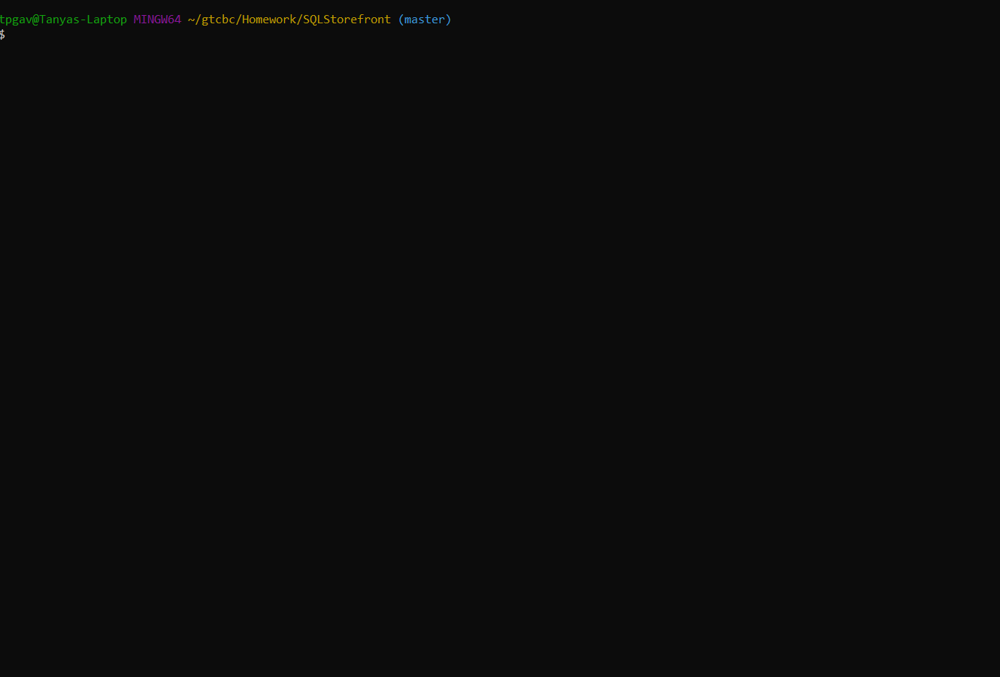

# SQL Storefront

CLI Storefront built using Node.js and MySQL 

## Demo

### SQL Database / Tables Created

## Code Explanation
- Schema.sql file contains query to create initial database and two tables (products and departments)
- Customer.js is run in node.js to initiate CLI Storefront
- File connects to MySQL database through localhost - password is saved in separate .env file
- Table is created showing products, and node's inquirer package is used to prompt what product the customer would like to purchase
- If valid selection and quantity are chosen, table updates with appropriate info and customer is prompted again with new updated table displayed
